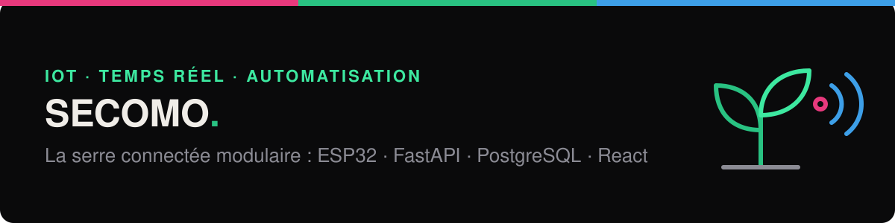
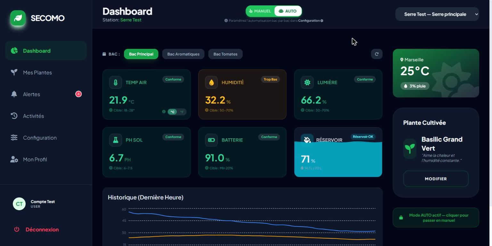
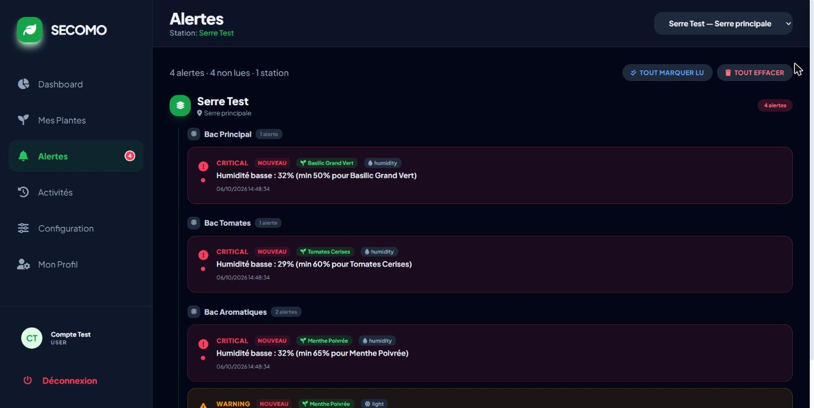
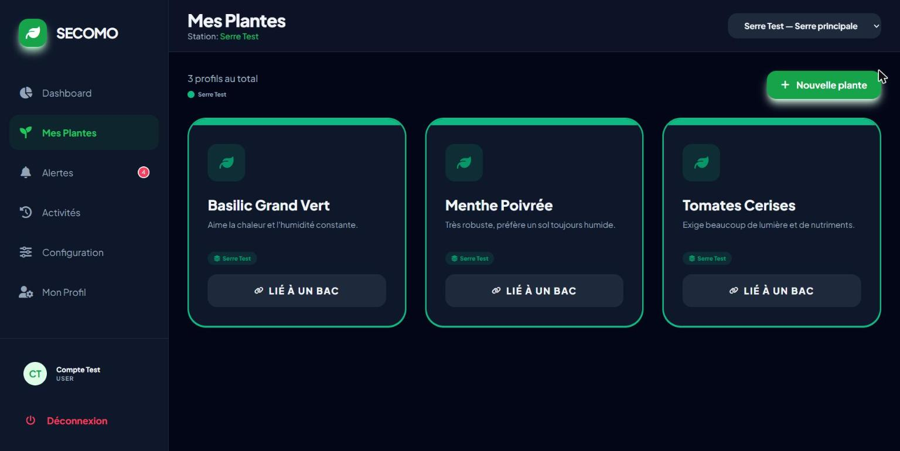
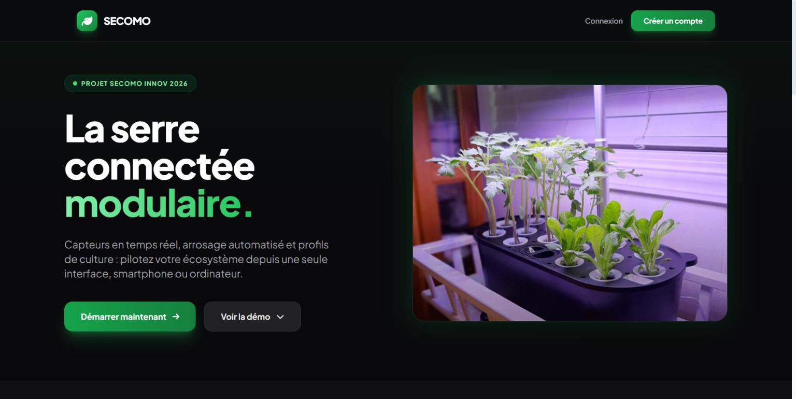
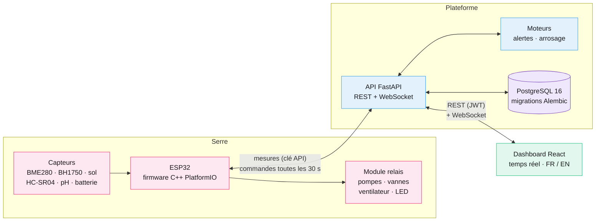
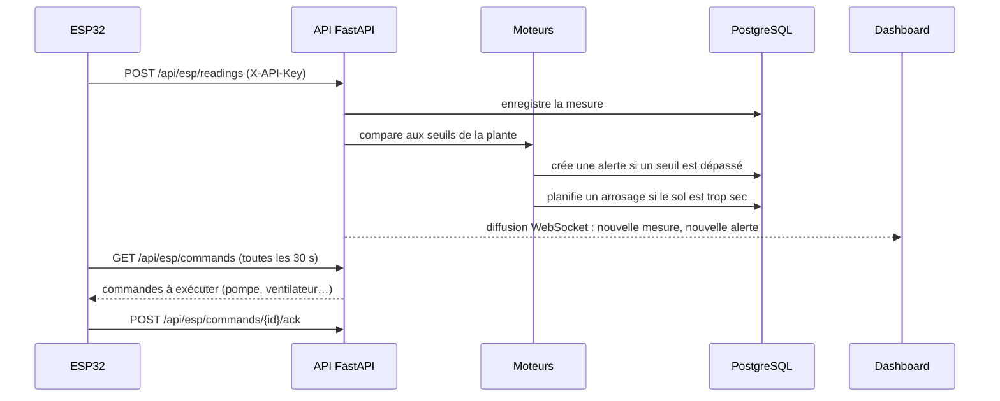

<p align="center">
  
</p>

<p align="center">
  
  
  
  
  
  
  
  
</p>

# SECOMO — Serre Connectée Modulaire

Un système complet pour **surveiller et piloter une serre** : un ESP32 lit les capteurs et
commande les actionneurs, une **API FastAPI** centralise les mesures et décide des alertes et de
l'arrosage, un **dashboard React** affiche tout en temps réel par WebSocket.

| | |
|---|---|
| **7** grandeurs mesurées (air, sol, lumière, pH, eau, batterie) | **6** actionneurs pilotés à distance (pompes, vannes, ventilateur, LED) |
| **37** routes d'API REST + 1 WebSocket temps réel | **5 515** plantes dans le catalogue intégré |
| Alertes et arrosage **automatiques** selon chaque plante | Plateforme complète en **une commande** Docker |

## Sommaire

- [Aperçu](#aperçu)
- [Architecture](#architecture)
- [Ce que fait le système](#ce-que-fait-le-système)
- [Lancer le projet](#lancer-le-projet)
- [Tester sans matériel](#tester-sans-matériel)
- [Le firmware ESP32](#le-firmware-esp32)
- [Structure du dépôt](#structure-du-dépôt)
- [Documentation](#documentation)
- [Feuille de route DevOps](#feuille-de-route-devops)

---

## Aperçu

<p align="center">
  <br>
  <b>Dashboard</b> : mesures en direct de chaque bac, comparées aux seuils de la plante cultivée
</p>

<table>
  <tr>
    <td width="50%"></td>
    <td width="50%"></td>
  </tr>
  <tr>
    <td align="center"><b>Alertes</b> générées automatiquement, par bac et par gravité</td>
    <td align="center"><b>Profils de plantes</b> et leurs seuils de culture</td>
  </tr>
</table>

<p align="center">
  
</p>

> Captures prises sur la plateforme lancée avec Docker Compose, alimentée par le
> [simulateur d'ESP32](#tester-sans-matériel).

## Architecture



**Le trajet d'une mesure**



## Ce que fait le système

**Mesure et suivi**
- Température et humidité de l'air, humidité du sol, luminosité, pH, niveau du réservoir,
  batterie.
- Historique en graphiques, par bac et par plage de temps.

**Décisions automatiques**
- **Moteur d'alertes** : chaque mesure est comparée aux seuils de la plante du bac et produit des
  alertes info, warning ou critical, en tenant compte de la nuit.
- **Moteur d'arrosage** : calcule la durée de pompage nécessaire pour remonter l'humidité du sol
  jusqu'à la cible, selon la taille du bac, avec un délai minimum entre deux arrosages.
- **Sécurité côté ESP32** : durée maximale par actionneur, pompe bloquée si le réservoir est trop
  bas, mode dégradé si le backend ne répond plus.

**Organisation**
- Plusieurs serres (stations) organisées en grilles de bacs, chaque bac relié à un ESP32.
- Profils de plantes personnalisables et catalogue de 5 515 plantes.
- Ajout d'un ESP32 par QR code et adresse MAC (*provisioning*).

**Interface** : bilingue français / anglais, thème clair ou sombre, adaptée au mobile.

**Sécurité**
- Comptes utilisateurs, mots de passe hachés (bcrypt), jetons JWT.
- Chaque ESP32 s'authentifie avec sa propre clé API.
- Aucun secret dans le code : variables d'environnement côté serveur, fichier `secrets.h` ignoré
  par Git côté firmware.

## Lancer le projet

Prérequis : Docker avec Docker Compose.

```bash
cp .env.example .env
docker compose up -d --build --wait
```

| Service | Adresse |
|---|---|
| Dashboard | http://localhost:8080 |
| API | http://localhost:8000 |
| Documentation de l'API (Swagger) | http://localhost:8000/docs |
| Santé de l'API | http://localhost:8000/api/health |

Avec `SEED_DEMO_ACCOUNT=true` (valeur du fichier d'exemple), un compte de démonstration est créé
avec une serre et 3 bacs : `test@secomo.io` / `Test1234!`. L'option est désactivée par défaut et
ne doit jamais être activée en production.

<details>
<summary>Lancer sans Docker (développement)</summary>

```bash
# API : Python 3.11+ et une base PostgreSQL accessible
cd backend
python -m venv venv && source venv/bin/activate
pip install -r requirements.txt
uvicorn app.main:app --reload

# Dashboard : Node.js 18+
cd frontend
npm install
npm run dev
```

</details>

## Tester sans matériel

Le script [`esp32/tools/simulate_device.py`](esp32/tools/simulate_device.py) se fait passer pour
un ESP32 et envoie des mesures réalistes à l'API. Il n'utilise que la bibliothèque standard de
Python.

```bash
# Clés API des bacs du compte de démonstration
docker compose exec db psql -U secomo -d secomo -c "select name, api_key from devices"

# Envoyer 60 mesures, une toutes les 5 secondes
python esp32/tools/simulate_device.py --api-key <CLE_DU_BAC> --count 60 --interval 5
```

## Le firmware ESP32

Code C++ pour ESP32 DevKit v1, compilé avec PlatformIO, découpé en modules : `sensors`,
`actuators`, `network`, `automation`, `provisioning`.

```bash
cd esp32
cp src/secrets.example.h src/secrets.h   # WiFi et adresse du backend (fichier ignoré par Git)
pio run --target upload
pio device monitor                       # 115200 bauds
```

<details>
<summary>Branchements des capteurs et des actionneurs</summary>

| Capteur | Mesure | Interface | Broche(s) |
|---|---|---|---|
| BME280 | Température, humidité de l'air, pression | I2C | SDA 21, SCL 22 |
| BH1750 | Luminosité (lux) | I2C | SDA 21, SCL 22 |
| Capteur capacitif | Humidité du sol | Analogique | GPIO 32 |
| HC-SR04 | Niveau du réservoir | Trig / Echo | GPIO 5 / 18 |
| PH4502C | pH | Analogique | GPIO 33 |
| Pont diviseur | Batterie | Analogique | GPIO 36 |

| Broche | Actionneur (module relais) |
|---|---|
| GPIO 26 | Pompe principale |
| GPIO 27 | Pompe péristaltique |
| GPIO 14 | Ventilateur |
| GPIO 12 | Électrovanne A |
| GPIO 13 | LED horticole |
| GPIO 25 | Électrovanne B |

</details>

## Structure du dépôt

```text
.
├── backend/                 API FastAPI
│   ├── app/routers/         12 routeurs : auth, plantes, appareils, capteurs, alertes, arrosage, WebSocket…
│   ├── app/services/        Moteurs d'alertes et d'arrosage, données initiales
│   ├── app/models/          Modèles SQLAlchemy (async)
│   └── alembic/             Migrations de la base
├── frontend/                Dashboard React + Vite (servi par Nginx en conteneur)
├── esp32/
│   ├── src/                 Firmware C++ (PlatformIO)
│   └── tools/               Simulateur d'ESP32, moniteur série, générateur de QR codes
├── docs/                    Notice utilisateur, cahier des charges embarqué, déploiement
├── docker-compose.yml       Base + API + dashboard en local
└── .env.example             Variables à copier dans .env
```

## Documentation

- [Notice utilisateur](docs/notice-utilisateur.md) : prise en main du dashboard.
- [Cahier des charges embarqué](docs/cahier-des-charges-embarque.md) : capteurs, actionneurs,
  protocole, modes dégradés.
- [Déploiement du backend](docs/deploiement-backend.md) : variables d'environnement et hébergement.

## Feuille de route DevOps

La suite du projet industrialise la plateforme :

- [ ] Tests automatisés de l'API
- [ ] Pipeline CI/CD **Jenkins** : tests, build des images, scan de sécurité, déploiement
- [ ] Déploiement sur **Kubernetes**
- [ ] Préparation des machines avec **Ansible**
- [ ] **Monitoring** : métriques Prometheus, tableaux de bord Grafana, alertes

---

<p align="center">
  <b>Salma Baba</b> · Ingénieure DevOps & DevSecOps ·
  <a href="https://salmababa.com">salmababa.com</a>
</p>
